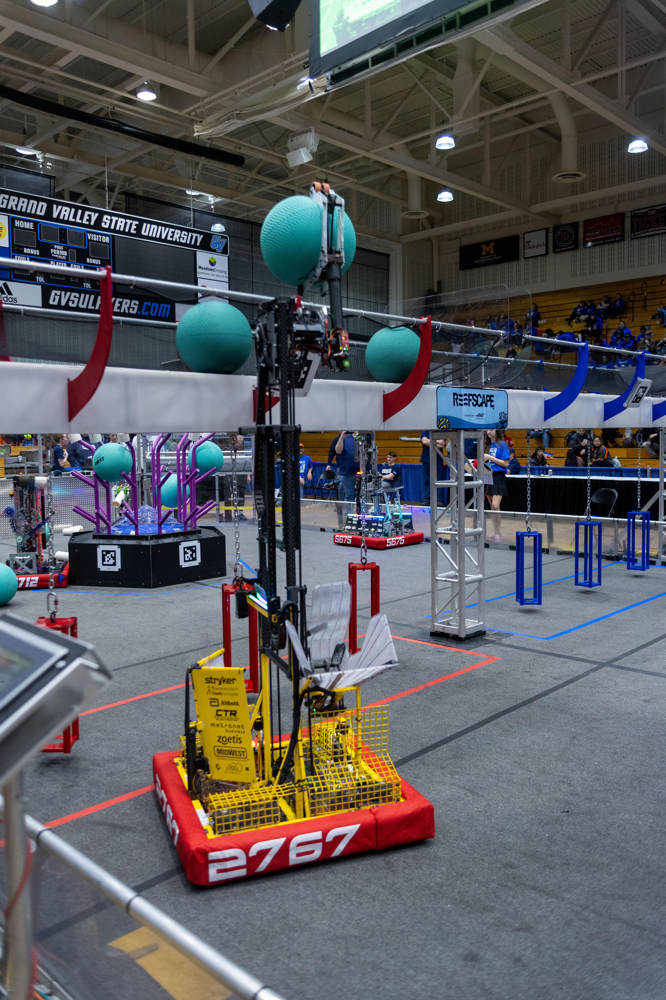
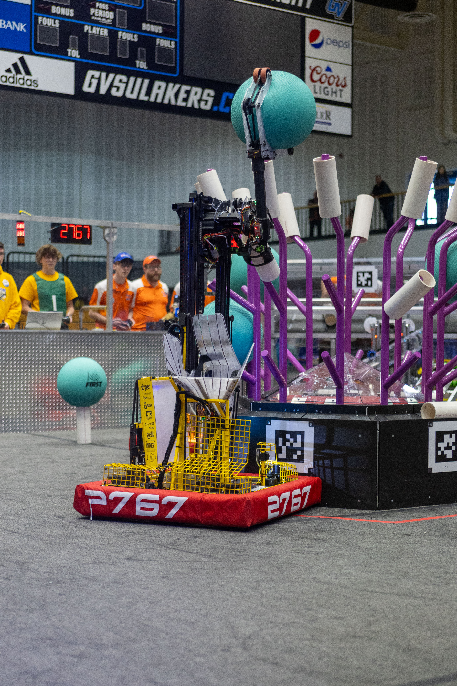
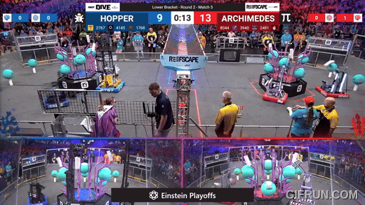
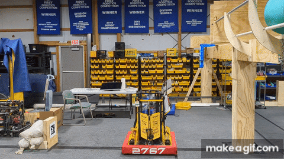
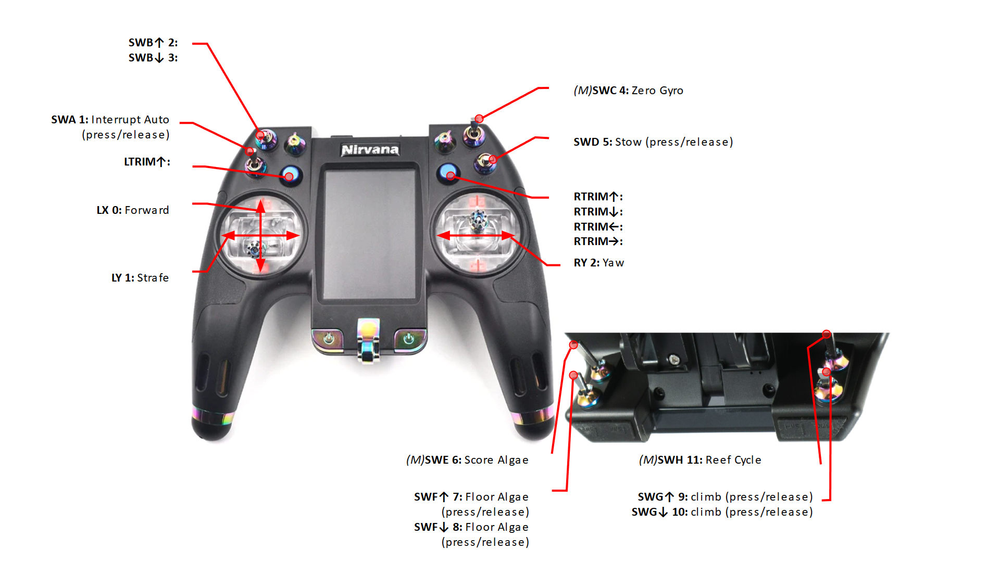
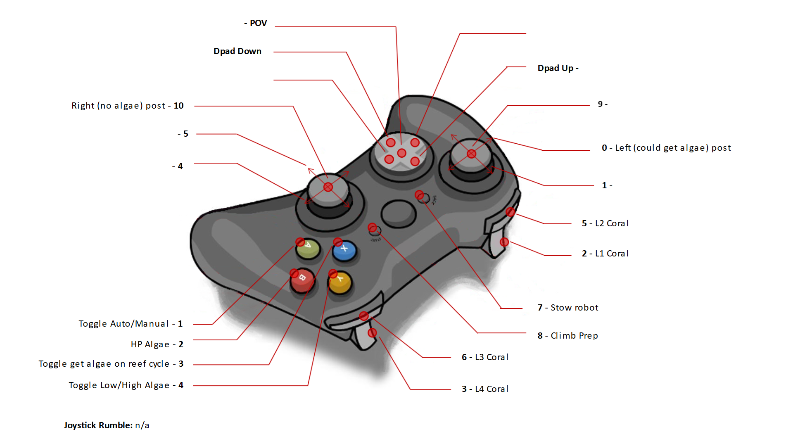
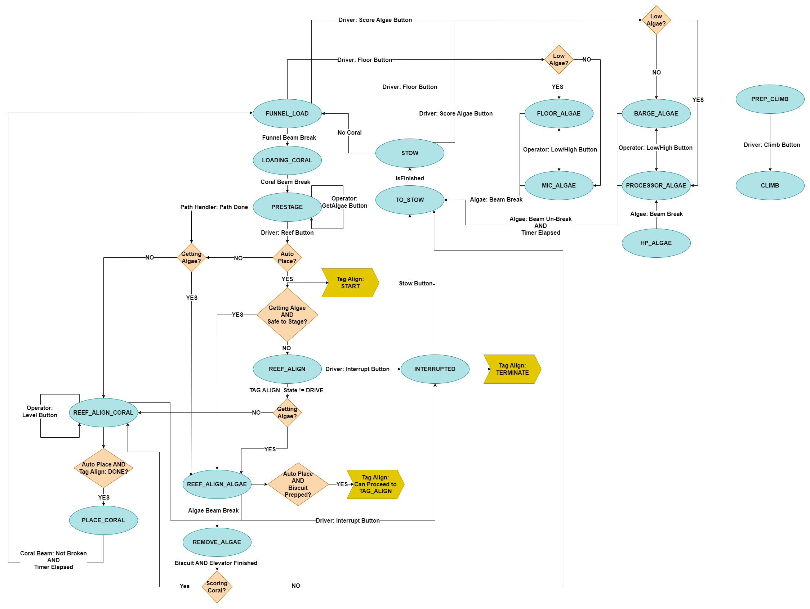

# 2025 FIRST REEFSCAPE

  
&nbsp; &nbsp;
  

## Controls

<table>
  <tr><th>Driver Controls</th><th>Operator Controls</th></tr>
  <tr><td>
  </td><td></td></tr>
</table>

## State Diagrams

<table>
  <tr><th>Robot State</th><th>Tag Align</th></tr>
  <tr><td></td>
  <td></td></tr>
</table>

## CAN Bus

| Subsystem | Type     | Talon                     | ID  | CAN BUS | Comp PDP | Proto PDP | Motor  | Breaker |
| --------- | -------- | ------------------------- | --- | ------- | -------- | --------- | ------ | ------- |
| Drive     | FXS      | azimuth                   | 0   | FD      |          | 16        | Minion |         |
| Drive     | FXS      | azimuth                   | 1   | FD      |          | 17        | Minion |         |
| Drive     | FXS      | azimuth                   | 2   | FD      |          | 6         | Minion |         |
| Drive     | FXS      | azimuth                   | 3   | FD      |          | 7         | Minion |         |
| Drive     | FX       | drive                     | 10  | FD      |          | 23        | kraken |         |
| Drive     | FX       | drive                     | 11  | FD      |          | 22        | kraken |         |
| Drive     | FX       | drive                     | 12  | FD      |          | 0         | kraken |         |
| Drive     | FX       | drive                     | 13  | FD      |          | 1         | kraken |         |
| Elevator  | FX       | elevatorMain              | 20  | rio     |          | 21        | kraken |         |
| Elevator  | FX       | elevatorFollow            | 21  | rio     |          | 20        | kraken |         |
| Biscuit   | FXS      | biscuit                   | 25  | rio     |          | 3         | Minion |         |
| Algae     | FXS      | algae                     | 30  | rio     |          |           | Minion |         |
| Coral     | FXS      | coral                     | 35  | rio     |          | 2         | Minion |         |
| Funnel    | FXS      | rollers                   | 40  | rio     |          |           | Minion |         |
| Climb     | FX       | frontMain                 | 45  | rio     |          |           | Minion |         |
| Climb     | FX       | backFollow                | 46  | rio     |          |           | kraken |         |
| Climb     | CANcoder | CANCoder                  | 47  | ri0     |          |           | n/a    |         |
| -         | -        | rio                       | -   | both    |          | 12        |        |         |
| -         | -        | vrm (radio, pigeon)       | -   | -       |          | 13        |        |         |
| -         | -        | custom circuit (pi power) | -   | -       |          |           |        |         |

## VRM
| Device          | Voltage | Current | ID  |
| --------------- | ------- | ------- | --- |
| Pigeon 2        | 12      | 0.5     | 4   |
| Ethernet Switch | 12      | 2       |     |
| Headlights      | 12      | 0.5     |     |

## Beam Breaks
| Subsystem | Talon   | ID  | Fwd/Rev | Purpose            |
| --------- | ------- | --- | ------- | ------------------ |
| Funnel    | rollers | 40  | REV     | Coral Presence     |
| Coral     | wheels  | 35  | REV     | Coral partially in |
| Coral     | wheels  | 35  | FWD     | Coral fully in     |
| Algae     | algae   | 30  | FWD     | Algae in claw      |
| Algae     | algae   | 30  | REV     | Lvl 1 Coral in     |

## Roborio
| Subsystem | Interface | Device   |
| --------- | --------- | -------- |
| n/a       | USB       | CANivore |

<table>
  <tr><th>DIO</th><th>MXP</th><th>PWM</th><th>Analog</th></tr>
  <tr><td>

| Subsystem  | name             | ID  |
| ---------- | ---------------- | --- |
| BattMon    | Batt I           | 0   |
| BattMon    | PDP V            | 1   |
| BattMon    | Breaker T        | 2   |
| TagServo   | Headlight Enable | 3   |
| AutoSwitch | switch           | 4   |
| AutoSwitch | switch           | 5   |
| AutoSwitch | switch           | 6   |
| AutoSwitch | switch           | 7   |
| AutoSwitch | switch           | 8   |
| AutoSwitch | switch           | 9   |
  </td><td>

| Subsystem | name | ID  |
| --------- | ---- | --- |
|           |      | 10  |
|           |      | 11  |
|           |      | 12  |
|           |      | 13  |
|           |      | 14  |
|           |      | 15  |
|           |      | 16  |
|           |      | 17  |
|           |      | 18  |
|           |      | 19  |
|           |      | 20  |
|           |      | 21  |
|           |      | 22  |
|           |      | 23  |
|           |      | 24  |
|           |      | 25  |
  </td><td>

| Subsystem | name         | ID  |
| --------- | ------------ | --- |
| LED       | lights       | 0   |
| Climb     | deployServo  | 1   |
| Climb     | ratchetServo | 2   |
|           |              | 3   |
|           |              | 4   |
|           |              | 5   |
|           |              | 6   |
|           |              | 7   |
|           |              | 8   |
|           |              | 9   | 
  </td><td>
    
| Subsystem | name | ID  |
| --------- | ---- | --- |
|           |      | 0   |
|           |      | 1   |
|           |      | 2   |
|           |      | 3   |
|           |      | 4   |
|           |      | 5   |
|           |      | 6   |
|           |      | 7   |
|           |      | 8   |
|           |      | 9   |
  </td></tr>
</table>

## Cameras
| Camera      | IP Address  | Type    |
| ----------- | ----------- | ------- |
| Left Servo  | 10.27.67.11 | USB 3.0 |
| Right Servo | 10.27.67.12 | USB 3.0 |
| Rear Left   | 10.27.67.13 | USB 2.0 |
| Rear Right  | 10.27.67.13 | USB 2.0 |

## Autos
| ID   | Start Loc                | Description                               | Status           |
| ---- | ------------------------ | ----------------------------------------- | ---------------- |
| 0x00 | non-processor shallow    | 3.5 piece Coral                           | Tested           |
| 0x01 | non-processor mid        | 4 piece Coral                             | Needs Tuning     |
| 0x02 | non-processor mid        | 3.5 piece Coral                           | Tested           |
| 0x03 | non-processor deep barge | IRI - 3 Algae                             | Partially Tested |
| 0x04 | non-processor Kettering  | 2 Mic to barge, Supercycle I              | Tested           |
| 0x05 | non-processor Kettering  | 2 Mic to barge, Supercycle I, rearCams on | Not Te       |
| 0x10 | Middle Barge             | 2.5 Algae, Non-Processor First            | Tested           |
| 0x11 | Middle Barge             | 2.5 Algae, Processor First                | Tested           |
| 0x12 | Middle Barge             | 2 Algae, Non-Processor                    | Tested           |
| 0x13 | Middle Barge             | 2 Algae, Processor                        | Tested           |
| 0x14 | Middle Barge             | Super-Cycle then Steal Processor          | Tested           |
| 0x15 | Middle Barge             | Steal Immediately Processor               | Tested           |
| 0x16 | Middle Barge             | Coral then Steal Processor                | Tested           |
| 0x17 | Middle Barge             | Coral then Steal Two                      | Tested           |
| 0x18 | Middle Barge             | Super-Cycle then Steal Front              | Partially Tested |
| 0x20 | processor shallow        | 3.5 piece Coral                           | Tested           |
| 0x21 | processor shallow        | 4 piece Coral                             | Needs Tuning     |
| 0x22 | processor mid            | 3.5 piece Coral                           | Tested           |

## LEDs

<table>
  <tr><th>Super Structure Strip</th><th>Front Strip</th><th>Back Strip</th></tr>
  <tr><td>

| Strip Segment      | Color  | Pattern  | Meaning              |
| ------------------ | ------ | -------- | -------------------- |
| Coral Level        | Red    | Solid    | Level 1              |
| Coral Level        | Yellow | Solid    | Level 2              |
| Coral Level        | Green  | Solid    | Level 3              |
| Coral Level        | Blue   | Solid    | Level 4              |
| Auto Score Side    | Black  | Solid    | Manual               |
| Auto Score Side    | Purple | Solid    | Left Post            |
| Auto Score Side    | Orange | Solid    | Right Post           |
| Get Algae On Cycle | Teal   | Solid    | Get Algae            |
| Get Algae On Cycle | Black  | Solid    | No Algae             |
| Full Strip         | Blue   | Blinking | Auto Place Active    |
| Full Strip         | Red    | Blinking | Thermal Limit Active |
| Full Strip         | Red    | Solid    | Climb Too Far        |
| Full Strip         | Green  | Solid    | Climb Good           |
| Full Strip         | Blue   | Solid    | Climb Too Close      |

</td><td>

| Strip Segment | Color  | Pattern  | Meaning              |
| ------------- | ------ | -------- | -------------------- |
| Upper         | Orange | Solid    | No Coral in Bot      |
| Upper         | Purple | Solid    | Coral in Transit     |
| Upper         | White  | Solid    | Coral Fully Loaded   |
| Lower         | Black  | Solid    | No Algae in Bot      |
| Lower         | Teal   | Solid    | Algae in Claw        |
| Full Strip    | Blue   | Blinking | Auto Place Active    |
| Full Strip    | Red    | Blinking | Thermal Limit Active |
| Full Strip    | Red    | Solid    | Climb Too Far        |
| Full Strip    | Green  | Solid    | Climb Good           |
| Full Strip    | Blue   | Solid    | Climb Too Close      |
  
</td><td>

| Strip Segment | Color  | Pattern  | Meaning              |
| ------------- | ------ | -------- | -------------------- |
| Full Strip    | Blue   | Solid    | High Algae           |
| Full Strip    | Brown  | Solid    | Low Algae            |
| Full Strip    | Blue   | Blinking | Auto Place Active    |
| Full Strip    | Red    | Blinking | Thermal Limit Active |
| Full Strip    | Red    | Solid    | Climb Too Far        |
| Full Strip    | Green  | Solid    | Climb Good           |
| Full Strip    | Blue   | Solid    | Climb Too Close      |
  
</td></tr>

